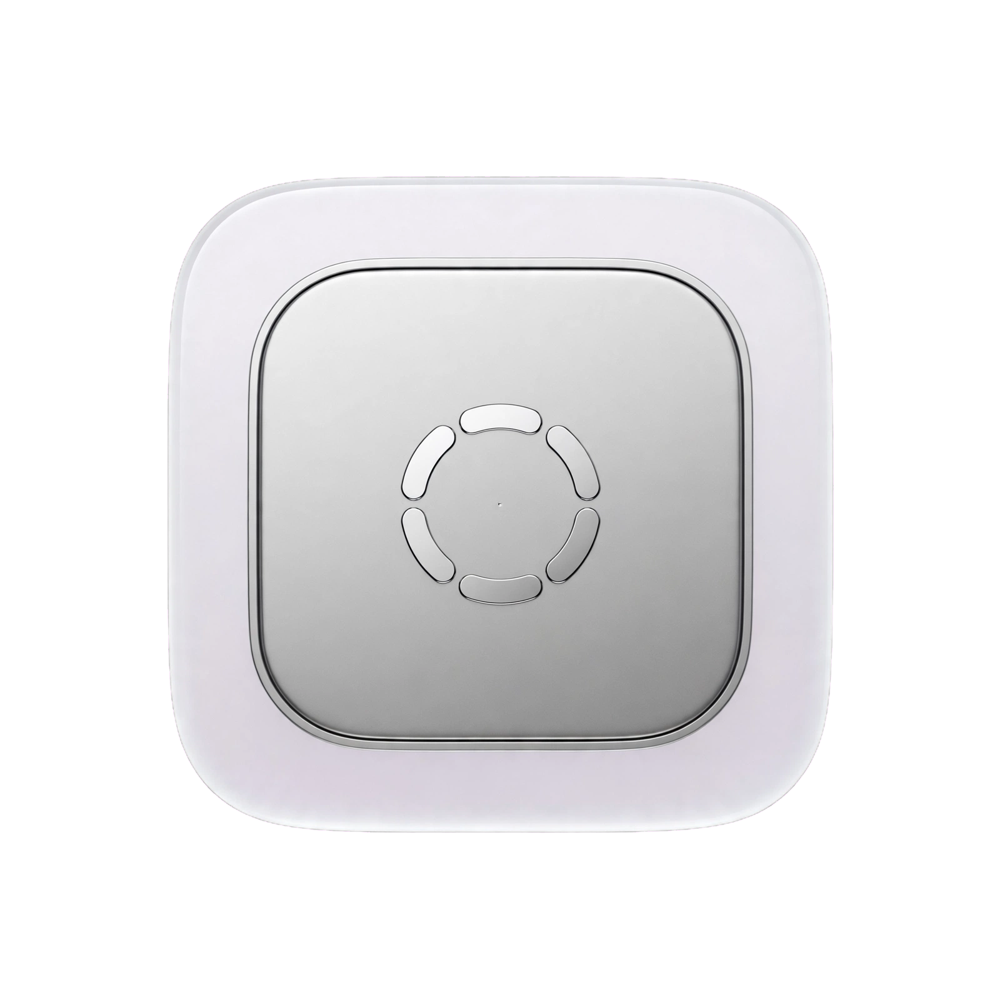

# Crypt — v1.0.1
### WWDC26 Golden Gate Vault style Monero monitor & miner

Clean as hell, built like Apple made it. Liquid Glass, no fake window chrome.

**By dodgybill**



## Features
- **Overview**: Peek at network (1.72 GH/s, v14), pruning summary with live speed + ETA, mining performance preview
- **Pruning**: Large progress (2256304/3760540), blocks/sec calculation, ETA, detailed stats + live log tail. Auto-hides at 100%
- **Mining**: Pure performance dashboard — hashrate 1m/5m/15m, shares, difficulty, p2pool, CPU temp, threads, sparkline graph. Wallet address REQUIRED before Mine unlocks
- **Logs**: Full-height monospaced viewer

## Build
App is named **Crypt.app**, runnable from Downloads and installs to /Applications.

```bash
chmod +x build.sh
./build.sh
```

Or manually:
```bash
# Icon
mkdir icon.iconset
sips -z 1024 1024 Resources/vault.png --out icon.iconset/icon_512x512@2x.png
iconutil -c icns icon.iconset -o Vault.icns

# Build
swiftc src/main.swift -o Crypt -framework Cocoa -framework WebKit
mkdir -p Crypt.app/Contents/MacOS Crypt.app/Contents/Resources
mv Crypt Crypt.app/Contents/MacOS/
cp Vault.icns Crypt.app/Contents/Resources/AppIcon.icns
cp Resources/monero-monitor.html Crypt.app/Contents/Resources/
```

## Structure
- `src/main.swift` — native WKWebView wrapper
- `Resources/monero-monitor.html` — Golden Gate UI
- `Resources/vault.png` — transparent vault logo
- `build.sh` — one-click builder + installer to /Applications

v1.0.1 Developed by dodgybill
